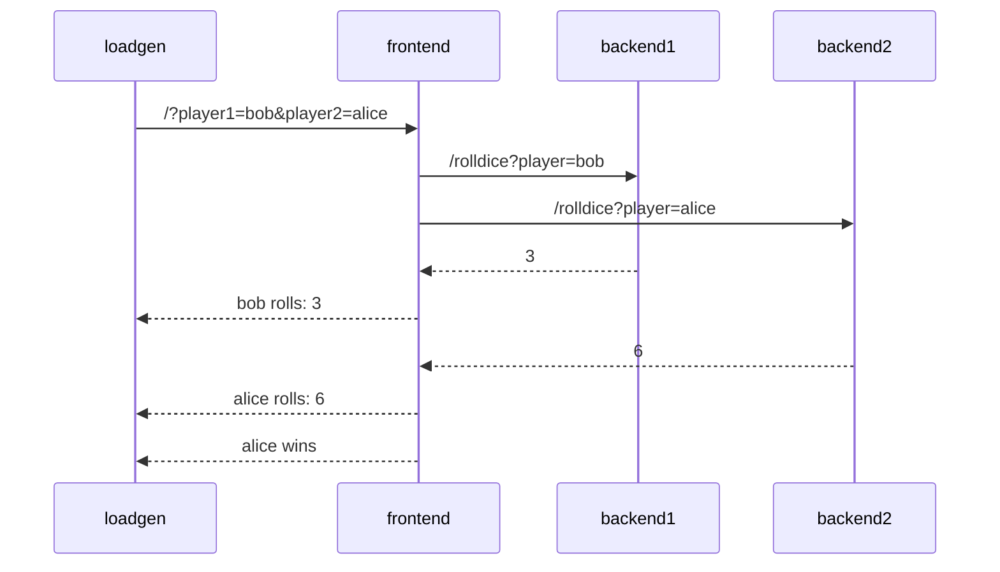
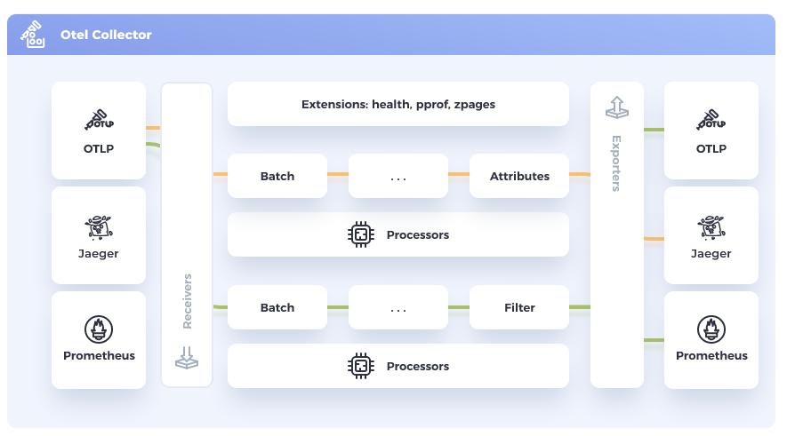
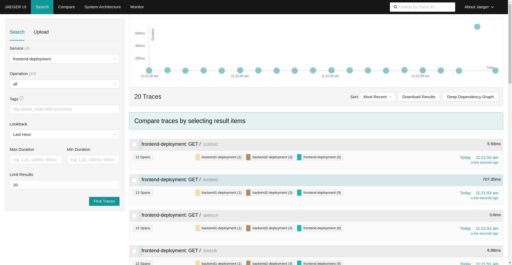
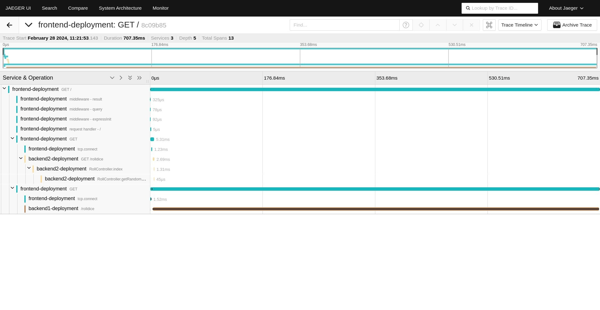
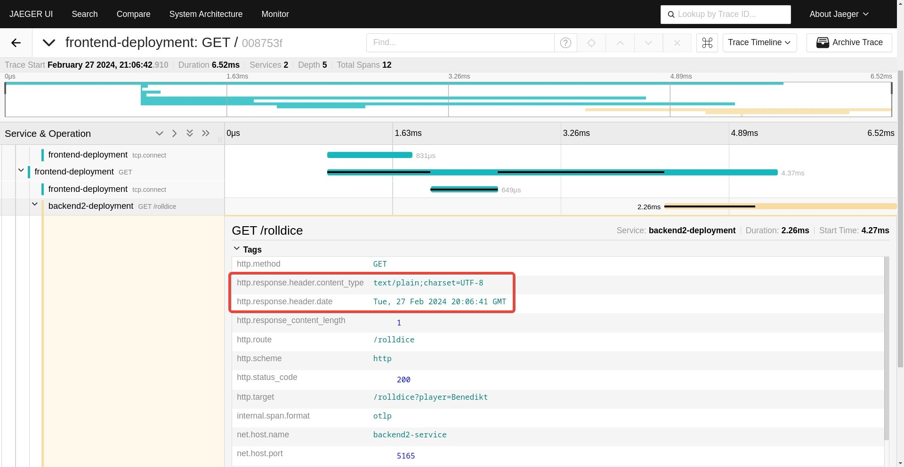

# Auto-instrumentation

<!---  Recording https://vimeo.com/917479681/f57ec76c52   -->

## Application Description

The sample application is a simple _"dice game"_, where two players roll a
dice, and the player with the highest number wins.

There are 3 microservices within this application:

- Service `frontend` in Node.JS, that has an API endpoint `/` which takes two
  player names as query parameters (player1 and player2). The service calls 2
  down stream services (backend1, backend2), which each returning a random number
  between 1-6. The winner is computed and returned.
- Service `backend1` in python, that has an API endpoint `/rolldice` which takes
  a player name as query parameter. The service returns a random number between
  1 and 6.
- Service `backend2` in Java, that also has an API endpoint `/rolldice` which
  takes a player name as query parameter. The service returns a random number
  between 1 and 6.

Additionally there is a `loadgen` service, which utilizes `curl` to periodically
call the frontend service.

Let's assume player `alice` and `bob` use our service, here's a potential
sequence diagram:



### Deploy the app into Kubernetes

Deploy the application into the kubernetes cluster. The app will be deployed into `demo-app` namespace.

```bash
kubectl apply -f https://raw.githubusercontent.com/rohitti12/hackathon/refs/heads/main/app/k8s.yaml
kubectl get pods -n demo-app -w
...
NAME                                   READY   STATUS    RESTARTS   AGE
backend1-deployment-577cf945b4-tz5kv   1/1     Running   0          62s
backend2-deployment-59d4b47774-xbq84   1/1     Running   0          62s
frontend-deployment-678795956d-zwg4q   1/1     Running   0          62s
```

Now expose the frontend app:

```bash
kubectl apply -f https://raw.githubusercontent.com/rohitti12/hackathon/refs/heads/main/backend/frontend-ing.yaml
```

Open browser at [http://localhost:4000/](http://localhost:4000/).

## Manual or Automatic Instrumentation?

To make your application emit traces, metrics & logs you can either instrument
your application _manually_ or _automatically_:

- Manual instrumentation means that you modify your code yourself: you initialize and
  configure the SDK, you load instrumentation libraries, you create your own spans,
  metrics using the API.
  Developers can use this approach to tune the observability of their application to
  their needs, but it requires a lot of initial time investment, expertise how (RPC) frameworks and client work and maintenance over time.
- Automatic instrumentation means that you don't have to touch your code to get your
  application emit telemetry data.
  Automatic instrumentation is great to get you started with OpenTelemetry, and it is
  also valuable for Application Operators, who have no access or insights about the
  source code.

In this demo we will cover using OpenTelemetry auto-instrumentation.

## Instrument the demo application

In this section we will deploy the app into Kubernetes and instrument it with OpenTelemetry auto-instrumentation
using the [Instrumentation CRD](https://github.com/open-telemetry/opentelemetry-operator?tab=readme-ov-file#opentelemetry-auto-instrumentation-injection) provided by the OpenTelemetry operator.
Then we will modify the app to create custom spans and collector additional attributes.

### Deploy OpenTelemetry collector



Deploy OpenTelemetry collector that will receive data from the instrumented workloads.

See the [OpenTelemetryCollector CR](./backend/03-collector.yaml).

```bash
kubectl apply -f https://raw.githubusercontent.com/rohitti12/hackathon/refs/heads/main/backend/03-collector.yaml
kubectl get pods -n observability-backend -w
```

### Create instrumentation CR and see traces in the Jaeger console

Now let's instrument the app with the `Instrumentation` CR and see traces in the Jaeger console.

First the Instrumentation CR needs to be created in the `demo-app` namespace:

See the [Instrumentation CR](./app/instrumentation.yaml).

```bash
kubectl apply -f https://raw.githubusercontent.com/rohitti12/hackathon/refs/heads/main/app/instrumentation.yaml
kubectl get pods -n demo-app -w
...                                                                                                                                                                                                                                                                                        
NAME                                   READY   STATUS    RESTARTS   AGE
backend1-deployment-577cf945b4-tz5kv   1/1     Running   0          8m59s
backend2-deployment-59d4b47774-xbq84   1/1     Running   0          8m59s
frontend-deployment-678795956d-zwg4q   1/1     Running   0          8m59s
```

The `Instrumentation` CR does not instrument the workloads. The instrumentation needs to be enabled by annotating a pod:

```bash
kubectl patch deployment frontend-deployment -n demo-app -p '{"spec": {"template":{"metadata":{"annotations":{"instrumentation.opentelemetry.io/inject-sdk":"true"}}}} }'
kubectl patch deployment backend1-deployment -n demo-app -p '{"spec": {"template":{"metadata":{"annotations":{"instrumentation.opentelemetry.io/inject-python":"true"}}}} }'
kubectl patch deployment backend2-deployment -n demo-app -p '{"spec": {"template":{"metadata":{"annotations":{"instrumentation.opentelemetry.io/inject-java":"true"}}}} }'
kubectl get pods -n demo-app -w
# Port forward again -> kubectl port-forward service/frontend-service -n demo-app 4000:4000 
...
NAME                                   READY   STATUS              RESTARTS   AGE
backend1-deployment-559946d88-c6zq7    0/1     Init:0/1            0          1s
backend2-deployment-5658ddfd6d-gz6ql   0/1     Init:0/1            0          1s
frontend-deployment-79b9c46d76-n74gr   0/1     ContainerCreating   0          1s
```

See the `backend2` pod spec:

```bash
kubectl describe pod backend2-deployment-5658ddfd6d-gz6ql -n demo-app
...
Init Containers:
  opentelemetry-auto-instrumentation-java:
    Image:         ghcr.io/open-telemetry/opentelemetry-operator/autoinstrumentation-java:1.32.1
    Command:
      cp
      /javaagent.jar
      /otel-auto-instrumentation-java/javaagent.jar
    Mounts:
      /otel-auto-instrumentation-java from opentelemetry-auto-instrumentation-java (rw)
      /var/run/secrets/kubernetes.io/serviceaccount from kube-api-access-48z6x (ro)
Containers:
  backend2:
    Image:          ghcr.io/rohitti12/hackathon-backend2:latest
    Environment:
      OTEL_LOGS_EXPORTER:                  otlp
      JAVA_TOOL_OPTIONS:                    -javaagent:/otel-auto-instrumentation-java/javaagent.jar
      OTEL_SERVICE_NAME:                   backend2-deployment
      OTEL_EXPORTER_OTLP_ENDPOINT:         http://otel-collector.observability-backend.svc.cluster.local:4317
      OTEL_RESOURCE_ATTRIBUTES_POD_NAME:   backend2-deployment-5658ddfd6d-gz6ql (v1:metadata.name)
      OTEL_RESOURCE_ATTRIBUTES_NODE_NAME:   (v1:spec.nodeName)
      OTEL_PROPAGATORS:                    tracecontext,baggage,b3
      OTEL_TRACES_SAMPLER:                 parentbased_traceidratio
      OTEL_TRACES_SAMPLER_ARG:             1
      OTEL_RESOURCE_ATTRIBUTES:            k8s.container.name=backend2,k8s.deployment.name=backend2-deployment,k8s.namespace.name=demo-app,k8s.node.name=$(OTEL_RESOURCE_ATTRIBUTES_NODE_NAME),k8s.pod.name=$(OTEL_RESOURCE_ATTRIBUTES_POD_NAME),k8s.replicaset.name=backend2-deployment-5658ddfd6d,service.version=latest
    Mounts:
      /otel-auto-instrumentation-java from opentelemetry-auto-instrumentation-java (rw)
```

Now let's execute some requests on the app [http://localhost:4000/](http://localhost:4000/) and see traces in the Jaeger console [http://localhost:16686/](http://localhost:16686/).




In addition to traces in the Java auto-instrumentation also emits **logs** and **metrics**.
The logs in our case are printed into the collector stdout via `debug` exporter and metrics are sent via OTLP HTTP into Prometheus.
The OpenTelemetry spec defines that the following metrics should be collected: [HTTP metrics](https://opentelemetry.io/docs/specs/semconv/http/http-metrics/).

```bash
kubectl logs deployment.apps/otel-collector -n observability-backend
...


### Customize Java auto-instrumentation with config (capture more data)

In this section we will configure the Java auto-instrumentation by modifying `Instrumentation` CR to:
* create custom spans - for the main method of the application
* capture server response HTTP headers

See the [Java agent docs](https://opentelemetry.io/docs/languages/java/automatic/configuration/) with all the configuration options.

See the [Instrumentation CR](./app/instrumentation-java-custom-config.yaml).

```bash
kubectl apply -f https://raw.githubusercontent.com/rohitti12/hackathon/refs/heads/main/app/instrumentation-java-custom-config.yaml
kubectl rollout restart deployment.apps/backend2-deployment -n demo-app
kubectl get pods -w -n demo-app
```


