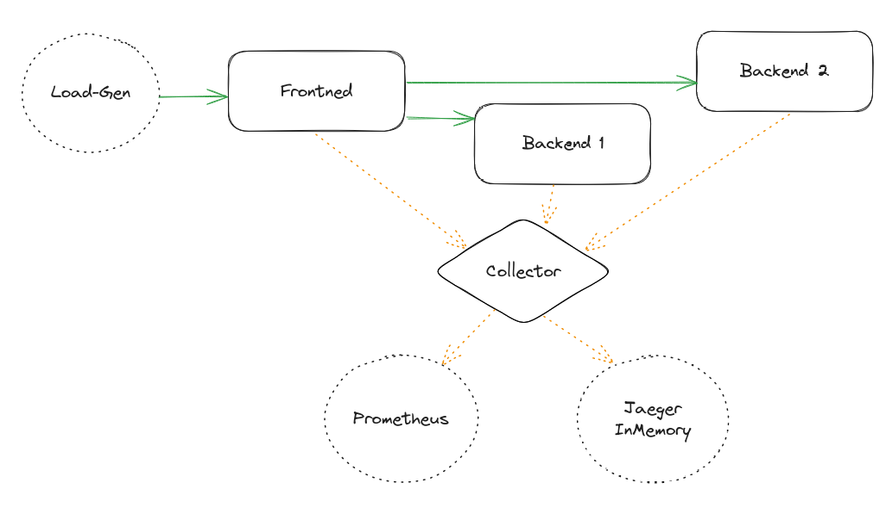
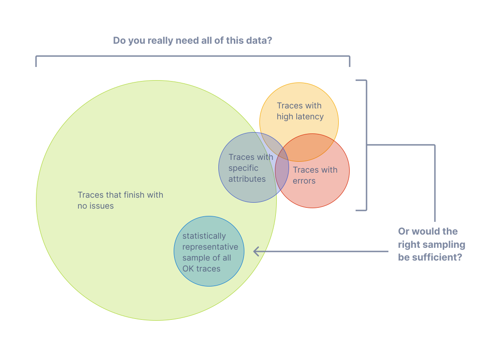
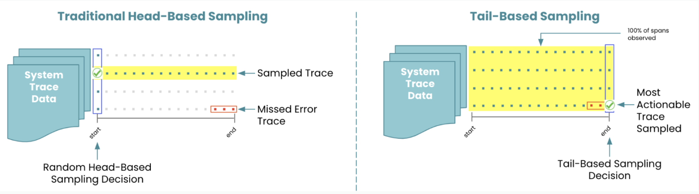

# Sampling

This tutorial step covers the basic usage of the OpenTelemetry Collector on Kubernetes and how to reduce costs using sampling techniques.

## Overview

In chapter 3 we saw the [schematic structure of the dice game application](https://github.com/pavolloffay/kubecon-eu-2024-opentelemetry-kubernetes-tracing-tutorial/blob/main/03-auto-instrumentation.md#application-description). The following diagram illustrates how the telemetry data collected there is exported and stored. [excalidraw](https://excalidraw.com/#json=15BrdSOMEkc9RA5cxeqwz,urTmfk01mbx7V-PpQI7KgA)



## Sampling, what does it mean and why is it important?

Sampling refers to the practice of selectively capturing and recording traces of requests flowing through a distributed system, rather than capturing every single request. It is crucial in distributed tracing systems because modern distributed applications often generate a massive volume of requests and transactions, which can overwhelm the tracing infrastructure or lead to excessive storage costs if every request is traced in detail.


### How can we now reduce the number of traces?



### Comparing Sampling Approaches



### How to implement head sampling with OpenTelemetry

Head sampling is a sampling technique used to make a sampling decision as early as possible. A decision to sample or drop a span or trace is not made by inspecting the trace as a whole.

For the list of all available samplers, check the [offical documentation](https://opentelemetry.io/docs/languages/sdk-configuration/general/#otel_traces_sampler)

#### Auto Instrumentation

Update the sampling % in the Auto Instrumentation CR and restart the deployment for the configurations to take effect.

https://github.com/pavolloffay/kubecon-eu-2024-opentelemetry-kubernetes-tracing-tutorial/blob/d4b917c1cc4a411f59ae5dd770b22de1de9f6020/app/instrumentation-head-sampling.yaml#L13-L15

```yaml
kubectl apply -f https://raw.githubusercontent.com/pavolloffay/kubecon-eu-2024-opentelemetry-kubernetes-tracing-tutorial/main/app/instrumentation-head-sampling.yaml
kubectl rollout restart deployment.apps/backend1-deployment -n tutorial-application
kubectl get pods -w -n tutorial-application
```

Describe the pod spec for the backend1 deployment to see the updated sampling rate.

```bash
kubectl describe pod backend1-deployment-64ddcc76fd-w85zh -n tutorial-application
```

```diff
    Environment:
          OTEL_TRACES_SAMPLER:                 parentbased_traceidratio
-         OTEL_TRACES_SAMPLER_ARG:             1
+         OTEL_TRACES_SAMPLER_ARG:             0.5
```

This tells the SDK to sample spans such that only 50% of traces get created.

